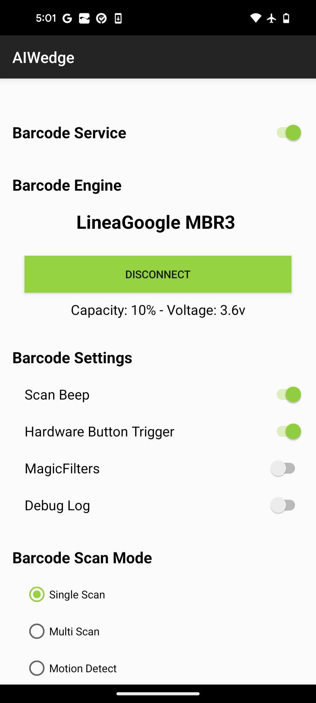
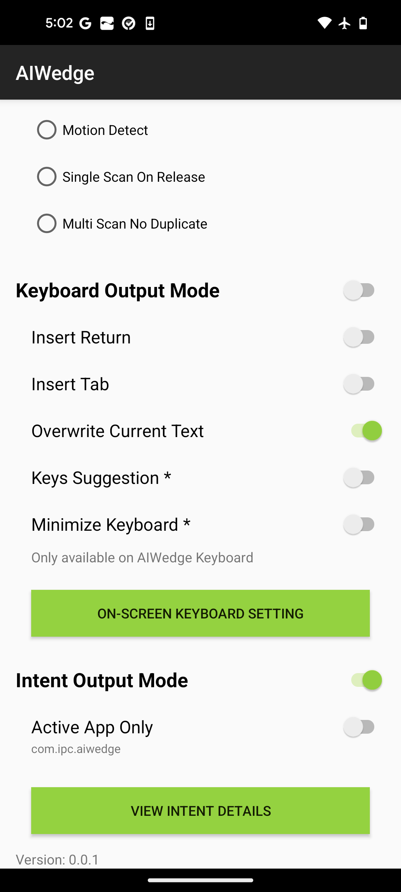
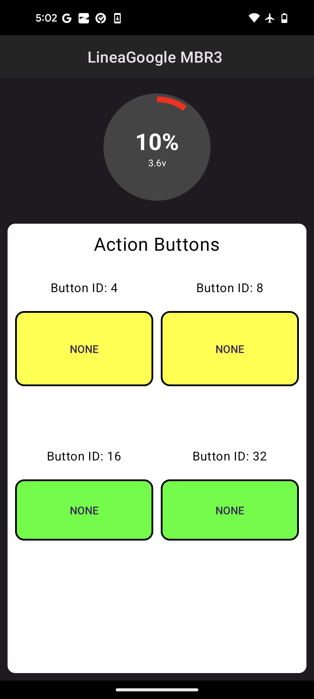
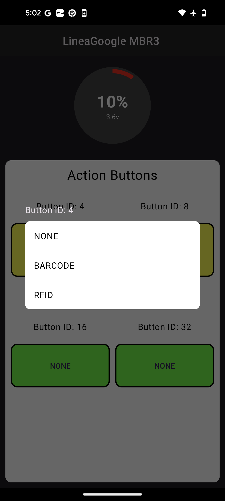
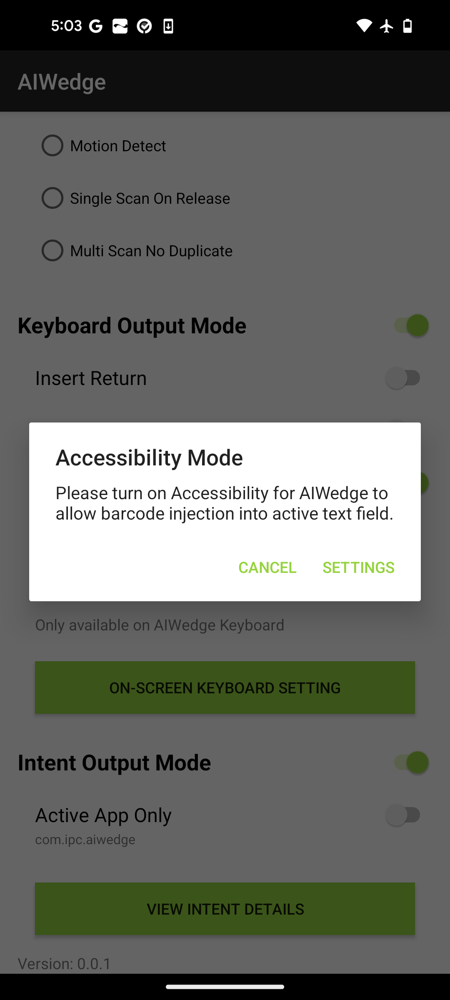
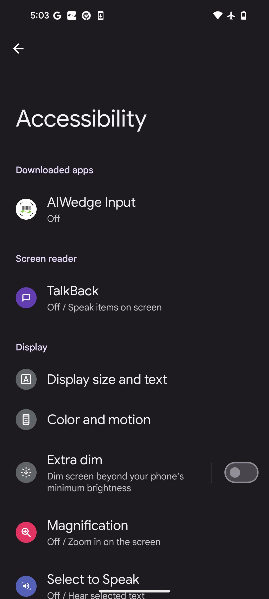
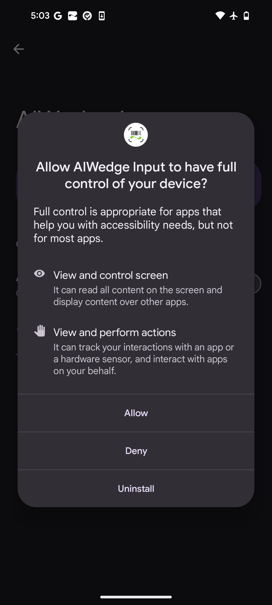
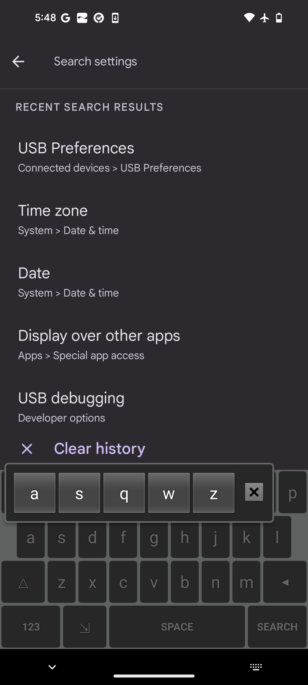
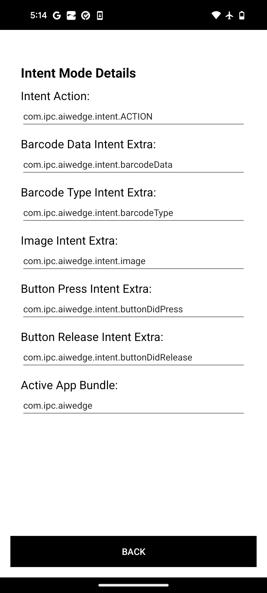

# AIWedge - Quick Start (Android) 
{: .fs-9 .no_toc }

AIWedge is a versatile Android app that captures barcode scans and images, transmitting them to target applications via keystrokes or intents. It allows users to configure settings, customize barcode processing through JavaScript, and manage the app through QR codes, intents, or mobile device management (MDM) solutions. Key features include a barcode service, multiple output modes (keyboard and intent), and advanced configuration options like MagicFilters for enhanced data handling.
{: .fs-5 .fw-300 }

Version 0.2 (Preview)
{: .fs-5 .fw-300 }

---
<details open markdown="block">
  <summary>
    Table of contents
  </summary>
  {: .text-delta }
1. TOC
{:toc}
</details>
---

## App Settings


 

### Barcode Service
*Barcode Service* is a foreground service that enables the Barcode Engine and listens for intents to act on the commands it receives. This service **must** be enabled for AIWedge to start the Barcode Engine and work properly.


### Barcode Engine
Barcode engine shows you the current barcode scanner device that is connected to AIWedge. If it is disconnected, tap CONNECT SCANNER to connect to your device. Check the box "Always open AIWedge when LineaGoogl is connected" when prompted.


### Barcode Settings
#### Scan Beep
When enabled, a beep will sound after each successful barcode scan, or when an image is captured.

#### Hardware Button Trigger
Enable or disable the hardware buttons on the device. 

##### Assign Button Action
To assign an action (e.g.: scanning Barcode) for a button, tap on the device name when it is connected. Tap an on-screen button and select an action for that button. Currently only BARCODE is supported. By default, buttons have no actions assigned.




#### MagicFilters
Filter or handle the barcode using JavaScript script. This script can be updated via MDM or intent.

#### Debug Log
Enable or disable debug log.


### Keyboard Output Mode
When enabled, and granted Accessibility permission to AIWedge, AIWedge will be able to inject scanned barcode to the active text field's cursor as keystrokes. 

- On Android phones, in order for Keyboard Output Mode to work: 
    - The Accessibility mode must be enabled for AIWedge app in *Android Settings > Accessibility > AIWedge Input > turn on "Use Service"*
    - `Active App Only` must be *Disabled*





#### Insert Return
Insert a new line after a barcode is scanned.

#### Insert Tab
Insert a tab after a scanned barcode.

#### Overwrite Current Text
Replace the current text of the active text field with the scanned barcode.

#### Keys Suggestion
When this option is enabled, hold down a key on the AIWedge keyboard will present a suggestion for the keys surrounding. 

For example: when holding down the 'A' key, a suggestion will popup with the keys surrounding: A, S, Q, W, Z




### Intent Output Mode
This mode enables or disables AIWedge's Barcode Service to broadcast the scanned barcode, and captured image to any apps that registered for the custom intent actions. Tap on "VIEW INTENT DETAILS" to see a list of the available intents that can be registered in your app.



The default intents to retrieve data for receiver are as follow:
- Intent Action: `com.ipc.aiwedge.intent.ACTION`
    - The default action to listen for broadcast
- Barcode Data Intent Extra: `com.ipc.aiwedge.intent.barcodeData`
    - The default extra to retrieve the scanned barcode data
- Barcode Type Intent Extra: `com.ipc.aiwedge.intent.barcodeType`
    - The default extra to retrieve the barcode code type
- Image URI Intent Extra: `com.ipc.aiwedge.intent.image`
    - N/A
- Button Press Intent Extra: `com.ipc.aiwedge.intent.buttonDidPress`
    - The default extra to retrieve the pressed button ID
- Button Release Intent Extra: `com.ipc.aiwedge.intent.buttonDidRelease`
    - The default extra to retrieve the released button ID
- Active App Bundle: `com.company.appname`
    - The active bundle that the intent broadcast from AIWedge will be sent to if Active App Only is enabled.

#### How To Receive The Scanned Barcode
Your app can receive the barcode data via intent, if you add the Intent Action to your app's intent filters, by default, it is `com.ipc.aiwedge.intent.ACTION`. Then look for the barcode data extra, by default it is `com.ipc.aiwedge.intent.barcodeData`.

```Java
    private var broadcastReceiver = object: BroadcastReceiver() {
        override fun onReceive(context: Context?, intent: Intent?) {

            if (intent?.action == "com.ipc.qwedge.intent.ACTION") {
                val extras = intent!!.extras
                if (extras == null) {
                    return
                }

                if (extras.containsKey("com.ipc.qwedge.intent.barcodeData")) {
                    val barcodeData = extras.getString("com.ipc.qwedge.intent.barcodeData")
                    if (barcodeData != null) {
                        if (extras.containsKey("com.ipc.qwedge.intent.barcodeType")) {
                            val barcodeType = extras.getString("com.ipc.qwedge.intent.barcodeType")
                            if (barcodeType != null) {
                                // Do something with the barcodeData and barcodeType...
                                // ...
                            }
                        }
                    }
                }
            }
        }
    }
```

#### Active App Only
When this setting is enabled, data only broadcast to the active app bundle. 

To set your app as the active app to receive intents, you can send a configuration command via Intent to set as below:

```Java
    var config = Bundle()
    config.putString("packageName", this.packageName)

    Intent().also {
        it.action = "com.ipc.aiwedge.api.ACTION"
        it.putExtra("com.ipc.aiwedge.api.SET_CONFIG", config)
        sendBroadcast(it)
    }
```

It is recommended to send this configuration in your activity `onResume()` so that your app will always be the active app that would receive the broadcast intents from AIWedge.

You can also set the Active App Bundle directly in AIWedge app, by selecting `VIEW INTENT DETAILS`, and change the *Active App Bundle*

## Intent API
The intent API let any app send an intent with a command to AIWedge like start/stop the scan engine or capture an image, then the result intent will be sent to the app via the defined Intent API.

### Intent Action
All apps that want to send commands to AIWedge must use `com.ipc.aiwedge.api.ACTION` as the intent action.

#### Barcode Commands
The barcode scanner engine can be triggered via intent API as below:
```Java
    Intent().also { intent ->
        intent.setAction("com.ipc.aiwedge.api.ACTION")
        intent.putExtra("com.ipc.aiwedge.api.PACKAGE_NAME", this.packageName)
        intent.putExtra("com.ipc.aiwedge.api.SOFT_SCAN_TRIGGER", "START_SCANNING")
        sendBroadcast(intent)
    }
```
- Intent Action: `com.ipc.aiwedge.api.ACTION`
- Intent Extra: `com.ipc.aiwedge.api.PACKAGE_NAME` should be included with value of package name of the requesting app.
- Intent Extra: `com.ipc.aiwedge.api.SOFT_SCAN_TRIGGER` is the key, and the value must be one of below:
    - `START_SCANNING`: starts the scanner engine.
    - `STOP_SCANNING`: stops the scanner engine.
    - `TOGGLE_SCANNING`: toggle the scanner engine, by stopping it if it is running, or start it if it is not running.


## Set Configuration
AIWedge's configuration can be updated via QRCode, Intent or MDM. Below is a list of keys that can be configured:

```Java
    /// The active package name to send the intent to
    const val packageName = "packageName"

    /// Enable or Disabld Barcode Service
    /// Value is Boolean
    const val enableBarcodeService = "enableBarcodeService"

    /// Enable or Disable barcode filter script
    /// Value is Boolean
    const val enableBarcodeFilterScript = "enableBarcodeFilterScript"

    /// The JS rule that will be used to filter barcodes.
    /// Value is String
    const val activeFilter = "activeFilter"

    /// Enable or Disable scan beep when a barcode is scanned.
    /// Value is Boolean
    const val enableScanBeep = "enableScanBeep"

    /// Enable or Disable hardware button trigger. If enabled, the center button will be the scan button. If disabled, you can control the scan engine via Intent.
    /// Value is Boolean
    const val enableHardwareButtonTrigger = "enableHardwareButtonTrigger"

    /// Enable or Disable keyboard output mode. When enabled, and a text field is in focus, the barcode will be injected into the text field.
    /// Value is Boolean
    const val enableKeyboardOutputMode = "enableKeyboardOutputMode"

    /// Enable or Disable insert return at the end of the scanned barcode.
    /// Value is Boolean
    const val enableInsertReturn = "enableInsertReturn"

    /// Enable or Disable overwrite the current content in the text field when a new barcode is scanned.
    /// Value is Boolean
    const val enableOverwriteCurrentText = "enableOverwriteCurrentText"

    /// Enable or Disable keys suggestion on the AIWedge keyboard layout.
    /// When a key on the keyboard held down for a brief moment, a popup will be shown with suggested keys around the key that being held down.
    /// Value is Boolean
    const val enableKeysSuggestion = "enableKeysSuggestion"

    /// Enable or Disable intent output mode. This mode should be ON in order to receive the barcode via intents.
    /// Value is Boolean
    const val enableIntentOutputMode = "enableIntentOutputMode"

    /// The main intent API action. This action is used in the intent broadcast response to external app.
    /// By default it is set to "com.ipc.aiwedge.intent.ACTION", but you can change it to other string that your app already filtering for.
    /// Value is String
    const val intentAction = "intentAction"

    /// The barcode data extra hold the intent extra key that contains the barcode data on intent broadcast.
    /// If your app is already has an extra key set for the barcode data, you can set this value to match with your app.
    /// Value is String
    const val barcodeDataExtra = "barcodeDataExtra"

    /// The barcode type extra hold the intent extra key that contains the barcode type on intent broadcast.
    /// If your app is already has an extra key set for the barcode type, you can set this value to match with your app.
    /// Value is String
    const val barcodeTypeExtra = "barcodeTypeExtra"

    /// The barcode type text extra hold the intent extra key that contains the barcode type text on intent broadcast.
    /// If your app is already has an extra key set for the barcode type text, you can set this value to match with your app.
    /// Value is String
    const val barcodeTypeTextExtra = "barcodeTypeTextExtra"

    /// The image extra that hold the image path in the activity result.
    /// Value is String
    const val imageExtra = "imageExtra"

    /// The settings parameters to turn on/off symbologies.
    /// Value is String
    const val parameters = "parameters"

    /// Enable or Disable intent broadcast response to the active app on foreground only. 
    /// When disabled, any app register to receive barcode data via intent will receive the broadcast even in background.
    /// Value is Boolean
    const val enableActiveAppOnly = "enableActiveAppOnly"

    /// Enable or Disable debug logging.
    /// Value is Boolean
    const val enableDebugLog = "enableDebugLog"

    /// URL to download MagicFilters script from server and save to Documents/AIWedge/Script/ folder.
    /// Value is String
    const val magicFiltersURL = "magicFiltersURL"
```

### Set Configuration via QRCode
Configuration can be set by scanning a QRCode that contains the settings and their values. The QRCode must contains a JSON object with a root key named `AIWedgeBundle`:
```JSON
{
    "AIWedgeBundle" : {
        "enableScanBeep" : true,
        ...
    }
}
```

### Set Configuration via Intent
Below is an example to set configuration via Intent from another app:
```Java
    // Create a bundle that contains config values.
    var config = Bundle()
    // Enable scan beep
    config.putBoolean("enableScanBeep", true)
    // Enable hardware scan button
    config.putBoolean("enableHardwareButtonTrigger", true)

    // ... Some other configs ...

    // Setup intent with config
    Intent().also {
        it.action = "com.ipc.aiwedge.api.ACTION"
        it.putExtra("com.ipc.aiwedge.api.SET_CONFIG", config)
        sendBroadcast(it)
    }
```


## MagicFilters
With MagicFilters, you can write a JavaScript script to process the scanned barcode to determined if it should be accepted or rejected. You can check if the barcode contains any target characters or add prefix, suffix, or even return an entirely different barcode. If it is accepted, it would be sent to keyboard as keystroke, or broadcast via intent to all the apps that are setup to receive barcodes.

The returned barcode value can be a simple string, or even a JSON string.

### How to Create JavaScript File
You can write the JavaScript rules as normal as any other JavaScript files with a few important rules. Below is an example on how to create a JavaScript file (ModifyTestBarcode.js) that modify barcodes that match "Test" to a special barcode "12345" with symbology type 99. 

1. Creating The ModifyTestBarcode.js JavaScript File
JavaScript files are text files with the extension of .js and contain JavaScript code.

    ```JavaScript

        // The content has a main function which will be called by AIWedge 
        function ModifyTestBarcode(symbology, barcode) 
        {
            // Return the modified barcode
            if (barcode == "Test") {
                return { 
                    accept: true, 
                    adjBarcode: "12345", 
                    adjSymbology: "99", 
                    adjSymbologyText: "Code 99" };
            }

            // Return the barcode as is
            return {
                accept: true,
                adjBarcode: barcode
            }
        }
    
    ```

2. The main JavaScript function ModifyTestBarcode must take in 2 parameters:
    - Symbology (String)
    - Barcode (String)
    
3. The ModifyTestBarcode function must return an object with format as follow: 

    ```JavaScript
        { 
            accept: Boolean, 
            adjBarcode: String,
            adjSymbology: customSymbology,          // Optional
            adjSymbologyText: customSymbologyText   // Optional
        }
    ```
    - `accept`: the value should be a boolean, that tell AIWedge if the scanned barcode is accepted and passed the validation.
    - `adjBarcode`: the actual barcode value that should be broadcasted to your application, or a JSON string.
    - `adjSymbology`: the modified symbology type if you want to return a custom symbology, other than the original symbology from the engine.
    - `adjSymbologyText`: the modified symbology type text of your modified symbology above.
    
4. The JavaScript file name must match the main function name. 
    
    From the example above: the main function is called `ModifyTestBarcode`, so the JavaScript file name must be `ModifyTestBarcode.js`
    
5. JavaScript File Location

    The JavaScript file must be copied to this specified public location so AIWedge can look for it: 

    ```
        ..Internal shared storage/Documents/AIWedge/Scripts/
    ```

### Activate MagicFilters

To use MagicFilters, you need to enable `MagicFilters` either within the AIWedge app or via `Intent`, and send a configuration to tell AIWedge to use the JavaScript file that you just created.

Below is how you would enable `MagicFilters`, and set the active JavaScript rule that AIWedge should use to process barcodes via configuration:

```Java
    // Create a bundle that contains config values.
    var config = Bundle()
    // Enable Barcode Filter
    config.putBoolean("enableBarcodeFilterScript", true)
    // Set the active filter script
    config.putString("activeFilter", "ModifyTestBarcode")

    // Setup intent with config and send it.
    Intent().also {
        it.action = "com.ipc.aiwedge.api.ACTION"
        it.putExtra("com.ipc.aiwedge.api.SET_CONFIG", config)
        sendBroadcast(it)
    }
```