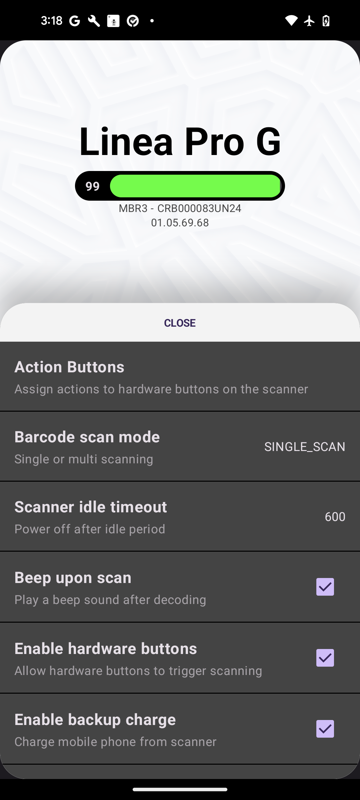

# AIWedge - Quick Start (Android) 
{: .fs-9 .no_toc }

AIWedge is a versatile Android app that captures barcode scans and images, transmitting them to target applications via keystrokes or intents. It allows users to configure settings, customize barcode processing through JavaScript, and manage the app through QR codes, intents, or mobile device management (MDM) solutions. Key features include a barcode service, multiple output modes (keyboard and intent), and advanced configuration options like MagicFilters for enhanced data handling.
{: .fs-5 .fw-300 }

Version 1.0.6 (Preview)
{: .fs-5 .fw-300 }

---
<details open markdown="block">
  <summary>
    Table of contents
  </summary>
  {: .text-delta }
1. TOC
{:toc}
</details>
---

<table style="width: 100%; text-align: center;">
  <tr>
    <td>
      <br>
      Connected
    </td>
    <td>
      <br>
      Disconnected
    </td>
  </tr>
</table>

## App Settings
### Device Information
The Device Information section contains Battery Indicator, Model, Serial, and Firmware Version
- The battery indicator shows real time battery level of the attached Linea Pro G (LPG). 
<br>
- Below the battery indicator are the device model (MBR3), serial (CRB000083UN24), and current installed firmware version (01.05.69.68).
<br>
- The included Smart Battery also contains information about the battery health. Tap on the battery indicator to see detail info about the Smart Battery.
<table style="width: 100%; text-align: center;">
  <tr>
    <td>
      <br>
      Battery Information
    </td>
  </tr>
</table>

### Device Settings
Device Settings contain some commonly used settings for the LPG, including the Action Buttons setting, and Update Firmware option.
- **Barcode scan mode**: Changing between Single scan or Multi scan.
    - SINGLE_SCAN: Scan barcode once.
    - MULTI_SCAN: Scan repeatedly in the same scanning session. The same barcode can be scanned multiple times.
    - MOTION_DETECT (Multi-Scan): The camera will detect motion, and active scan engine while the scan button is pressed. Or an Intent to start scanning is received.
    - SINGLE_SCAN_ON_RELEASE: Barcode only scanned when hardware button is released.
    - MULTI_SCAN_NO_DUPLICATE: Scan multiple different barcodes in the same session. Same barcode will only scanned once.
    - IMAGE_SCAN: *N/A*
<table style="width: 100%; text-align: center;">
  <tr>
    <td>
      <br>
      Barcode Scan Modes
    </td>
  </tr>
</table>

- **Scanner idle timeout**: The timeout to power off the LPG when idle, and not actively in used.
- **Beep upon scan**: Play a beep sound upon successful barcode decoding.
- **Enable hardware buttons**: Allow hardware buttons to be triggered.
- **Enable backup charge**: Charge the enclosed Pixel device using the LPG's battery. 
    - *Note: The LPG's battery will continue to charge the Pixel device until it runs out of power.*
- **Action Buttons**: The Action Buttons settings allow different Actions, or Plugins (if installed) to be triggered.  
    1. Select `Action Buttons` from menu. 
    2. Select the button you want to set action for.
    3. Select the action for that button.

<table style="width: 100%; text-align: center;">
  <tr>
    <td>
      <br>
      Device Settings
    </td>
    <td>
      <br>
      Action Buttons
    </td>
    <td>
      <br>
      Action Button Options
    </td>
  </tr>
</table>

- **Update Firmware**: Update the LPG's firmware.
    1. Download the firmware file onto the Pixel device.
    2. Select `Update Firmware` from menu.
    3. Select `Select Firmware` from menu.
    4. Browse and select the firmware file saved on the Pixel.
    5. Confirm the selected firmware file, and tap `Proceed`
    6. Wait for the device to finish updating firmware.
<table style="width: 100%; text-align: center;">
  <tr>
    <td>
      <br>
      Device Settings
    </td>
    <td>
      <br>
      Select Firmware
    </td>
    <td>
      <br>
      Browse Firmware File
    </td>
    <td>
      <br>
      Update Firmware Confirmation
    </td>
    <td>
      <br>
      Update Firmware Progress 
    </td>
  </tr>
</table>

<br>
<br>

### MagicFilter
**MagicFilter** enables AIWedge to utilize JavaScript for advanced post-scan processing. Upon scanning a barcode, the data is transmitted to the JavaScript for evaluation, and the processed result is returned as output. With MagicFilter, developers can create custom JavaScript scripts to determine whether a scanned barcode should be accepted or rejected. This allows for checks such as validating the presence of specific target characters, appending a prefix or suffix, or even replacing the barcode with a completely different value.

If the barcode is accepted, it can be output as a keystroke via the keyboard or broadcasted as an intent to all applications configured to receive barcode data. The returned barcode value can either be a simple string or a more complex format like a JSON string, offering flexibility in how the data is processed and transmitted.

#### How to create JavaScript file for use with MagicFilter
You can write the JavaScript script as normal with a few important rules. Below is an example on how to create a JavaScript file (ModifyTestBarcode.js) that modify barcodes that match "Test" to a special barcode "12345" with symbology type 99. 

1. Creating The ModifyTestBarcode.js JavaScript File

    JavaScript files are text files with the extension of .js and contain JavaScript code.

    **Note**: *The JavaScript **must** contains a function that has the same name as the file name. In this case, the function name is `ModifyTestBarcode`. AIWedge will only call this function.*

    ```JavaScript
        // The content has a main function which will be called by AIWedge 
        function ModifyTestBarcode(symbology, barcode) 
        {
            // Return the modified barcode
            if (barcode == "Test") {
                return { 
                    accept: true, 
                    adjBarcode: "12345", 
                    adjSymbology: "99", 
                    adjSymbologyText: "Code 99" };
            }

            // Return the barcode as is
            return {
                accept: true,
                adjBarcode: barcode
            }
        }
    ```

2. The main JavaScript function ModifyTestBarcode must take in 2 parameters:
    - 1st: Symbology (String)
    - 2nd: Barcode (String)
    
3. The ModifyTestBarcode function must return an object with format as follow: 

    ```JavaScript
        { 
            accept: Boolean, 
            adjBarcode: String,
            adjSymbology: customSymbology,          // Optional
            adjSymbologyText: customSymbologyText   // Optional
        }
    ```
    - `accept`: the value should be a boolean, which tells AIWedge if the scanned barcode is accepted and passed the validation.
    - `adjBarcode`: the actual barcode value that should be broadcasted to your application, or a JSON string.
    - `adjSymbology`: the modified symbology type if you want to return a custom symbology, other than the original symbology from the engine.
    - `adjSymbologyText`: the modified symbology type text of your modified symbology above.
    
4. The JavaScript file name must match the main function name. 

    From the example above: the main function is called `ModifyTestBarcode`, so the JavaScript file name must be `ModifyTestBarcode.js`
    
5. Load the JavaScript files onto the Pixel device, and imported manually in AIWedge app. 

    *Note: Due to retriction in API 34+, AIWedge can't load files from the public Documents folder anymore.*

#### How to enable and use MagicFilter
1. Select **MagicFilter** from main screen.
2. Enable **MagicFilter** by checking the checkbox.
3. Tap **Import Scripts** 
4. Browse and select the folder that contains the scripts
5. Select **Allow** on the popup "Allow AIWedge to access files in [Folder Name]"
6. All imported scripts should be displayed.
7. Enable only the script that you want to use. Multiple scripts processing post-scan is not supported.

<br>
<br>

## Data Output
### Keyboard Mode
<table style="width: 100%; text-align: center;">
  <tr>
    <td>
      <br>
      Keyboard Mode
    </td>
    <td>
      <br>
      Keyboard Mode (continue)
    </td>
  </tr>
</table>

**Keyboard Mode** allows scanned barcodes to be injected directly into an active text field via keystrokes from the on-screen keyboard. Keyboard Output Mode must be enabled in Keyboard Mode settings. By default, Keyboard Output Mode is disabled.

#### Data Injection Options
Keyboard Mode has 2 ways to inject scanned barcodes: 
- **Accessibility API**: This mode allows barcodes injection via the default on-screen keyboard, by utilizing the Accessibility API on Android.
- **AIWedge Keyboard**: This mode allows barcodes injection via the custom AIWedge built-in keyboard. When AIWedge Keyboard is enabled and active, the scanned barcodes can be injected into the active text field without the help of Accessibility API.

#### Keyboard Mode Settings
- **Keyboard Output Mode**: Enable or disable barcodes injection via keyboard.
- **Inject Using Accessibility**: Inject scanned barcodes via default on-screen keyboard by using Accessibility API.
- **Enable AIWedge Keyboard**: Inject scanned barcodes via custom AIWedge keyboard.
- **Set Default On-screen Keyboard**: Change the default on-screen keyboard.
- **Simulate Return/Enter Key**: Attempt to invoke the action key (Done, Search, Next, Send...) when barcode is scanned.
- **Simulate Tab Key**: Attempt to simulate Tab key press when barcode is scanned.
- **Replace Current Text**: Replace the current text in the text field with the scanned barcode.
- **Minimize AIWedge Keyboard**: Enable or disable AIWedge keyboard lauching in minimize mode. When this option is enabled, and the AIWedge keyboard is the active default keyboard, the AIWedge keyboard will launch in minimize mode, only showing 1 row of buttons. To get to full size keyboard, tap the expand button.

<br>
<br>

### Intent Mode
<table style="width: 100%; text-align: center;">
  <tr>
    <td>
      <br>
      Intent Mode
    </td>
    <td>
      <br>
      Intent Mode (continue)
    </td>
  </tr>
</table>

The **Intent Mode** in AIWedge allows the app to broadcast scanned barcodes and other data to any applications registered to receive the custom intent APIs. Additionally, it enables external apps to send configuration intents to AIWedge, allowing them to adjust AIWedge settings specifically tailored to their needs. To receive intent broadcast, **Intent Output Mode** must be enabled. By default, this mode is enabled.

#### Intent Action and Extras
The following are the default intent actions and extras that applications can register to receive. The ones with * can be changed by tapping on them and set new values.

- Intent Action* : `com.ipc.aiwedge.intent.ACTION`
    - The default action to listen for broadcast
- Barcode Data Intent Extra* : `com.ipc.aiwedge.intent.barcodeData`
    - The default extra to retrieve the scanned barcode data
- Barcode Type Intent Extra* : `com.ipc.aiwedge.intent.barcodeType`
    - The default extra to retrieve the barcode code type
- Image URI Intent Extra* : `com.ipc.aiwedge.intent.image`
    - The default extra which contain an image URI to retrieve the image.
- Button Press Intent Extra: `com.ipc.aiwedge.intent.buttonDidPress`
    - The default extra to retrieve the pressed button ID
- Button Release Intent Extra: `com.ipc.aiwedge.intent.buttonDidRelease`
    - The default extra to retrieve the released button ID
- Active App Only: This setting enables only sending broadcast data to the current active app ID set in Active App ID.
- Active App ID* : `com.ipc.aiwedge`
    - The active bundle that the intent broadcast from AIWedge will be sent to if Active App Only is enabled.

<br>
<br>

## Send and Receive Data via Intent
### How To Receive The Scanned Barcode via Intent
Your app can receive barcode data via intent by adding the intent action to your app’s intent filters. By default, the intent action is `com.ipc.aiwedge.intent.ACTION`. Once the intent is received, look for the barcode data extra, which is provided under the key `com.ipc.aiwedge.intent.barcodeData`, and barcode data type extra, which is the value of the key `com.ipc.aiwedge.intent.barcodeType`

```Java
    private var broadcastReceiver = object: BroadcastReceiver() {
        override fun onReceive(context: Context?, intent: Intent?) {

            if (intent?.action == "com.ipc.aiwedge.intent.ACTION") {
                val extras = intent!!.extras
                if (extras == null) {
                    return
                }

                if (extras.containsKey("com.ipc.aiwedge.intent.barcodeData")) {
                    val barcodeData = extras.getString("com.ipc.aiwedge.intent.barcodeData")
                    if (barcodeData != null) {
                        if (extras.containsKey("com.ipc.aiwedge.intent.barcodeType")) {
                            val barcodeType = extras.getString("com.ipc.aiwedge.intent.barcodeType")
                            if (barcodeType != null) {
                                // Do something with the barcodeData and barcodeType...
                                // ...
                            }
                        }
                    }
                }
            }
        }
    }
```

### AIWedge Configuration
AIWedge's configuration can be updated via Intent, MDM or QRCode. Below is a list of keys that can be configured:

```java
    /// The active package name to send the intent to
    const val packageName = "packageName"

    /// Enable or Disabld Barcode Service
    /// Value is Boolean
    const val enableBarcodeService = "enableBarcodeService"

    /// Enable or Disable barcode filter script
    /// Value is Boolean
    const val enableBarcodeFilterScript = "enableBarcodeFilterScript"

    /// The JS rule that will be used to filter barcodes.
    /// Value is String
    const val activeFilter = "activeFilter"

    /// Enable or Disable scan beep when a barcode is scanned.
    /// Value is Boolean
    const val enableScanBeep = "enableScanBeep"

    /// Enable or Disable hardware button trigger. If enabled, the center button will be the scan button. If disabled, you can control the scan engine via Intent.
    /// Value is Boolean
    const val enableHardwareButtonTrigger = "enableHardwareButtonTrigger"

    /// Enable or Disable keyboard output mode. When enabled, and a text field is in focus, the barcode will be injected into the text field.
    /// Value is Boolean
    const val enableKeyboardOutputMode = "enableKeyboardOutputMode"

    /// Enable or Disable insert return at the end of the scanned barcode.
    /// Value is Boolean
    const val enableInsertReturn = "enableInsertReturn"

    /// Enable or Disable overwrite the current content in the text field when a new barcode is scanned.
    /// Value is Boolean
    const val enableOverwriteCurrentText = "enableOverwriteCurrentText"

    /// Enable or Disable keys suggestion on the AIWedge keyboard layout.
    /// When a key on the keyboard held down for a brief moment, a popup will be shown with suggested keys around the key that being held down.
    /// Value is Boolean
    const val enableKeysSuggestion = "enableKeysSuggestion"

    /// Enable or Disable intent output mode. This mode should be ON in order to receive the barcode via intents.
    /// Value is Boolean
    const val enableIntentOutputMode = "enableIntentOutputMode"

    /// The main intent API action. This action is used in the intent broadcast response to external app.
    /// By default it is set to "com.ipc.aiwedge.intent.ACTION", but you can change it to other string that your app already filtering for.
    /// Value is String
    const val intentAction = "intentAction"

    /// The barcode data extra hold the intent extra key that contains the barcode data on intent broadcast.
    /// If your app is already has an extra key set for the barcode data, you can set this value to match with your app.
    /// Value is String
    const val barcodeDataExtra = "barcodeDataExtra"

    /// The barcode type extra hold the intent extra key that contains the barcode type on intent broadcast.
    /// If your app is already has an extra key set for the barcode type, you can set this value to match with your app.
    /// Value is String
    const val barcodeTypeExtra = "barcodeTypeExtra"

    /// The barcode type text extra hold the intent extra key that contains the barcode type text on intent broadcast.
    /// If your app is already has an extra key set for the barcode type text, you can set this value to match with your app.
    /// Value is String
    const val barcodeTypeTextExtra = "barcodeTypeTextExtra"

    /// The image extra that hold the image path in the activity result.
    /// Value is String
    const val imageExtra = "imageExtra"

    /// Enable or Disable intent broadcast response to the active app on foreground only. 
    /// When disabled, any app register to receive barcode data via intent will receive the broadcast even in background.
    /// Value is Boolean
    const val enableActiveAppOnly = "enableActiveAppOnly"

    /// Enable or Disable debug logging.
    /// Value is Boolean
    const val enableDebugLog = "enableDebugLog"

    /// URL to download MagicFilters script from server and save to Documents/AIWedge/Script/ folder.
    /// Value is String
    const val magicFiltersURL = "magicFiltersURL"

    /// Enable or Disable backup charge
    const val enableBackupCharge = "enableBackupCharge"

    /// The idle time out when not actively in use.
    const val idleTimeOut = "idleTimeOut"
```

#### Send Configuration via Intent
Below is an example to set configuration via Intent from another app:

```Java
    // Create a bundle that contains config values.
    var config = Bundle()
    // Enable scan beep
    config.putBoolean("enableScanBeep", true)
    // Enable hardware scan button
    config.putBoolean("enableHardwareButtonTrigger", true)
    // Enable Barcode Filter
    config.putBoolean("enableBarcodeFilterScript", true)
    // Set the active filter script
    config.putString("activeFilter", "ModifyTestBarcode")
    // Set the active app bundle ID
    config.putString("packageName", "com.company.appname")

    // ... Some other configs ...

    // Setup intent with config
    Intent().also {
        // AIWedge action to receive command
        it.action = "com.ipc.aiwedge.api.ACTION"
        // The config to send to AIWedge
        it.putExtra("com.ipc.aiwedge.api.SET_CONFIG", config)
        // Send
        sendBroadcast(it)
    }
```

#### Set Configuration via QRCode
Configuration can be set by scanning a QRCode that contains the settings and their values. The QRCode must contains a JSON object with a root key named `AIWedgeBundle`:

```Java
{
    "AIWedgeBundle" : {
        "enableScanBeep" : true,
        ...
    }
}
```

#### Trigger Barcode Scan via Command
The barcode scanner engine can be triggered via intent API as below:
```Java
    Intent().also { it ->
        // AIWedge action to receive command
        it.action = "com.ipc.aiwedge.api.ACTION"
        // App bundle ID that sending the command
        it.putExtra("com.ipc.aiwedge.api.PACKAGE_NAME", this.packageName)
        // The barcode trigger action
        it.putExtra("com.ipc.aiwedge.api.SOFT_SCAN_TRIGGER", "START_SCANNING")
        // Send
        sendBroadcast(it)
    }
```
- Intent Action: `com.ipc.aiwedge.api.ACTION`
- Intent Extra: `com.ipc.aiwedge.api.PACKAGE_NAME` should be included with value of package name of the requesting app.
- Intent Extra: `com.ipc.aiwedge.api.SOFT_SCAN_TRIGGER` is the key, and the value must be one of below:
    - `START_SCANNING`: starts the scanner engine.
    - `STOP_SCANNING`: stops the scanner engine.
    - `TOGGLE_SCANNING`: toggle the scanner engine, by stopping it if it is running, or start it if it is not running.
